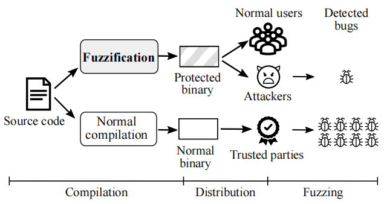
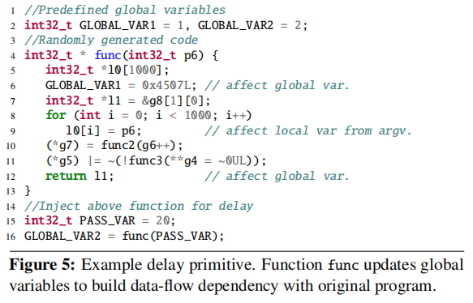
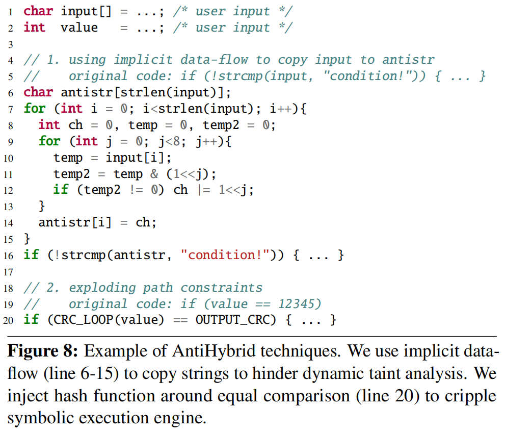

## FUZZIFICATION: ANTI-FUZZING TECHNIQUES

> **Fuzz技术是一种基于黑盒/灰盒的测试技术，通过自动化生成并执行大量的随机测试用例来发现产品或协议的未之漏洞，安全人员就可以利用这项技术进行安全测试发现漏洞，但不希望黑客来发现这个漏洞，同样的黑客也能利用这项技术可能在安全人员发现前进行攻击。**
>
> **为了解决这个问题，这篇文章提出了Fuzzification技术，提高黑客使用Fuzz的成本和难度，实际应用对内发布未处理的二进制文件，对外提供使用Fuzzification处理过后的二进制文件，这样能够使得安全人员在黑客之前发现漏洞并进行修补。**

有限的Anti-Fuzzing技术应该满足以下三个条件：

* 能够有效阻止现有的Fuzz工具，在固定时间内发现**更少的错误**
* 受保护的程序在正常状态下仍然能够**正常运行**
* **保护技术不应该被轻易识别**并通过patch从程序中删除

现有的技术：

* 软件混淆技术，但是会给正常执行带来很大的开销，另外只能够减缓单词Fuzz的速度，无法在路径上做文章
* 软件多样化，能够缓解攻击但无法隐藏根本漏洞

为了提高Fuzz的速度，一般会加速单词执行的速度或减少执行的次数：

* 单词执行加速：硬件、并行Fuzz
* 覆盖率：收集每次执行的代码覆盖率，并有限Fuzz触发新分支的输入，一般采用基本块或者分支来统计代码覆盖率
* 启发式：使用污点分析等方法帮助Fuzz

Anti-Fuzzing的原理如上，为内部人员提供经处理的二进制文件以方便内部人员通过Fuzz技术更快的发现更多的bug，而对外提供的是通过Fuzzification处理过的受保护的二进制文件，利用二者的Fuzz的差距从而实现目标。

本文提出的三种Fuzzification的技术：

* **SpeedBump：** 在二进制中插入延迟原语，在Fuzz时会频繁使用，而正常时不怎么使用
* **BranchTrap：** 构造对输入敏感的分支，使得基于覆盖率的Fuzzer多走弯路，同时有意使得频繁路径冲突，从而达到让Fuzzer无法识别触发新路径
* **AntiHybird：** 将显式数据流转化为隐式数据流，防止通过污点分析进行数据流跟踪，插入大量伪造符号执行过程中触发路劲爆炸

### **Speed Bump**

**原理：** Fuzzer在进行Fuzz的时候，会进入如错误处理的路径，而正常使用这些路径并不会被经常执行。所以这些路径的注入延迟原语，可以大大降低Fuzz执行的速度，且不会对正常执行产生大影响，因为几乎不会被执行在正常执行的状态下。

**方法：**

- 正常编译二进制文件，对二进制文件进行测试，找到cold path

  - 通过生成基本块的频率曲线识别cold path
- 确认注入延迟的cold path数目和延迟大小，使正常执行时开销在预算之内

  - 重复操作，调整延迟带下

如果使用简单的sleep等语句，可以简单的识别并去除，所以作者设计了基于CSmith的原语，使用算术运算并和原始代码关联。

### BranchTrap

**原理：**

对于使用覆盖率的Fuzzer，通过插入大量对输入敏感的分支，使得Fuzzer陷入对这些分支的分析中，误导Fuzzer。构造大量条件分支和间接跳转，这些条件分支与输入的字节相关，因此对输入敏感。

为了使Fuzzer关注假分支，作者考虑了以下四个方面

- 假分支足够多
- 注入的分支和路径对常规运行带来的开销印象小
- 路径需要与输入相关
- 无法被攻击者轻易去除

**方法：**

- **CFG变形：** 注入跳转表，使用输入作为索引，并且使用类似于ROP的方法，使用gadget
  - 优点1：与输入关联，所以Fuzzer不会忽略这些分支
  - 优点2：轻量级的解析跳转，对正常情况下影响小
  - 优点3：基于ROP方法，增加了去除的难度
- **Fuzzing饱和态：** 使Fuzzing状态饱和，在很少访问的分支中加入大量确定性分支

### **AntiHybird**

**原理：**

模糊测试污点分析存在以下弱点，符号执行和污点分析需要大量资源、容易受到路径爆炸问题、难以跟踪隐式的数据的依赖

**方法：**

将显式数据流转化为隐式数据流，对抗污点分析

注入多个代码块，有意触发路径爆炸，对抗符号执行
